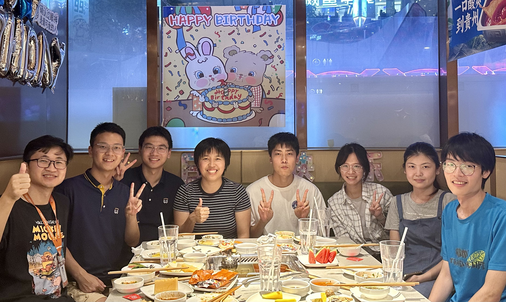

# Computational Materials Lab @ Westlake University

## About Us

Our research group focuses on computational materials science, aiming to understand, discover, design, and modify novel inorganic solid materials through computation. By combining artificial intelligence algorithms with various materials computation methods, we can establish an in-depth fundamental understanding of the core structure-property relationships in materials science from the microscopic atomic scale, and discover and design new materials that meet practical application requirements through high-throughput computation and data mining.

## Research Areas

- Solid-state Battery Materials
- Strategic Solid-state Synthesis
- AI for Materials Discovery

## Contact

- Email: zhuyizhou@westlake.edu.cn
- Address: Yungu Campus, Westlake University, 600 Dunyu Road, Xihu District, Hangzhou

## Website

Visit our website: [https://zhuyizhou.github.io](https://zhuyizhou.github.io) 